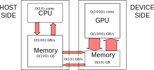

template: titleslide

# Introduction to GPU Programming with HIP
## EPCC, University of Edinburgh
## training@epcc.ed.ac.uk


---
template: titleslide
# Introduction


---
# A simple model of performance

A computer can be as simple as pictured below.

.center[]


What limits performance?

1. **Clock speed:** the rate of issue of instructions by the processor.
2. **Memory latency:** time taken to retrieve data from memory.
3. **Memory bandwidth:** amount of data transferred in unit time.
4. **Parallelism:** can the basic unit of architecture be replicated?


---
# Clock speed

- Processor clock speed determines the fundamental rate of processing instructions, and hence data.

- Historically, increases in CPU performance have been related to increases in clock speed. However, owing largely to power constraints, most modern processors have a clock speed of around 2-3 GHz.

- Without some unforeseen breakthrough, it is expected that this fundamental speed limit will continue to apply.


---
# Memory latency

- Memory latency is a serious concern.
  - It may take O(100-1000) clock cycles, from a standing start, to transfer an item of data from memory to a register on the processor, where it can be operated on.

- CPUs mitigate this problem by having caches.
  - The "closer" the cache is to the processor, the smaller the cache size in bytes, <br>but the faster the access.
  - Many caches have a hierarchical design, L1, L2, L3.


---
# Exercise (1 minute)

On an ARCHER2 login node, try the command below to reveal the cache hierarchy.

```bash
lscpu --caches
```


---
# Exercise (1 minute)

On an ARCHER2 login node, try the command below to reveal the cache hierarchy.

```bash
lscpu --caches
```

```bash
NAME ONE-SIZE ALL-SIZE WAYS TYPE        LEVEL  SETS PHY-LINE COHERENCY-SIZE
L1d       32K       4M    8 Data            1    64        1             64
L1i       32K       4M    8 Instruction     1    64        1             64
L2       512K      64M    8 Unified         2  1024        1             64
L3        16M     512M   16 Unified         3 16384        1             64
```

- Each CPU core has its own L1 and L2 cache.
- Each L3 cache however is shared by 4 CPU cores.


---
# Exercise (1 minute)

On an ARCHER2 login node, try the command below to reveal the cache hierarchy.

```bash
lscpu --caches
```

```bash
NAME ONE-SIZE ALL-SIZE WAYS TYPE        LEVEL  SETS PHY-LINE COHERENCY-SIZE
L1d       32K       4M    8 Data            1    64        1             64
L1i       32K       4M    8 Instruction     1    64        1             64
L2       512K      64M    8 Unified         2  1024        1             64
L3        16M     512M   16 Unified         3 16384        1             64
```

- Each CPU core has its own L1 and L2 cache.
- Each L3 cache however is shared by 4 CPU cores.
<br><br>
- Other latency hiding measures exist, such as **out-of-order** execution where instructions
are executed based on the availability of data, rather than the order originally specified.


---
# Memory bandwidth

- CPUs generally have commodity dynamic random access memory (DRAM).
  - The larger the memory size, the greater the cost (less money for the processor).
  - DRAM Size can vary on O(100) GB.
  - Maximum memory DRAM bandwidth is usually limited to O(100) GB/s.


---
# Memory bandwidth

- CPUs generally have commodity dynamic random access memory (DRAM).
  - The larger the memory size, the greater the cost (less money for the processor).
  - DRAM Size can vary on O(100) GB.
  - Maximum memory DRAM bandwidth is usually limited to O(100) GB/s.

<br>


---
# Parallelism

- While it is not possible to increase the clock speed of an individual processor,
one can use/add more processing units, i.e. cores.

- Many CPUs are now multi-core or many-core, with perhaps O(10) or O(100) cores.
Applications wishing to take advantage of such architectures *must* be parallel.


---
# Exercise (1 minute)

Run `lscpu` without any options to check how many cores, or processors, are available on ARCHER2.


---
# Exercise (1 minute)

Run `lscpu` without any options to check how many cores, or processors, are available on ARCHER2.


```bash
Architecture:            x86_64
  CPU op-mode(s):        32-bit, 64-bit
  Address sizes:         43 bits physical, 48 bits virtual
  Byte Order:            Little Endian
CPU(s):                  256
  On-line CPU(s) list:   0-255
Vendor ID:               AuthenticAMD
  Model name:            AMD EPYC 7742 64-Core Processor
    CPU family:          23
    Model:               49
    Thread(s) per core:  2
    Core(s) per socket:  64
    Socket(s):           2
...
```


---
# Graphics processors

- Driven by commercial interest (games), a many-core processor *par excellence* was developed, known as the graphics processor or GPU.
  - The hardware design is suited to the parallel pixel rendering, a trivially <br>parallel problem.

- GPU clocks speeds have, historically, lagged behind CPUs, but are now broadly similar.
  - Improvements in GPU performance relate to parallelism however: a modern GPU may have O(1000) cores.


---
# Graphics processors

- Driven by commercial interest (games), a many-core processor *par excellence* was developed, known as the graphics processor or GPU.
  - The hardware design is suited to the parallel pixel rendering, a trivially <br>parallel problem.

- GPU clocks speeds have, historically, lagged behind CPUs, but are now broadly similar.
  - Improvements in GPU performance relate to parallelism however: a modern GPU may have O(1000) cores.

- Memory latency is still an issue and is mitigated by very fast switching between parallel tasks, reducing idle time.

- GPUs typically include high-bandwidth memory (HBM).
  - Small capacity, O(10) GB, but large bandwidth, O(1000) GB/s.
  - This gives a better balance between data supply and data processing for the <br>parallel rendering problem.


---
# Hardware organisation

- The cores on AMD GPUs are organised into *compute units* or CUs for short.
  - Each CU contains several smaller processors called stream processors, responsible for performing the mathematical operations required for tasks such as rendering graphics, encoding video and scientific calculations.

- For example, an ARCHER2 GPU node has four AMD Instinct MI210 GPU devices.
  - Each device boasts 104 CUs and each CU houses 64 stream processors, resulting in a total of 6,656 stream processors working in tandem.


---
# Hardware organisation

- The cores on AMD GPUs are organised into *compute units* or CUs for short.
  - Each CU contains several smaller processors called stream processors, responsible for performing the mathematical operations required for tasks such as rendering graphics, encoding video and scientific calculations.

- For example, an ARCHER2 GPU node has four AMD Instinct MI210 GPU devices.
  - Each device boasts 104 CUs and each CU houses 64 stream processors, resulting in a total of 6,656 stream processors working in tandem.


- A more complete overview can be found at [AMD Instinct Accelerators.](https://www.amd.com/en/technologies/cdna.html#instinct)

<br>
- For NVIDIA GPUs, the picture is essentially similar, although some of the jargon differs, e.g. Streaming multiprocessors (SMs) instead of compute units (CUs).


---
# Host/device architecture

- GPUs are typically 'hosted' by a standard CPU, responsible for orchestration <br>of GPU activities.

- The CPU and GPU are often referred to as *host* and *device* respectively.

.center[]

- Typically, the host (a multi-core CPU) can support 4-8 GPU devices.