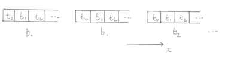
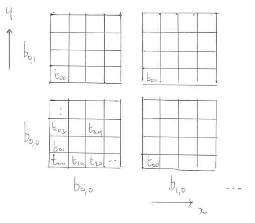

template: titleslide
# The HIP (CUDA) Programming Model


---
# The HIP (CUDA) programming model

- The application programmer shouldn't have to worry about how the device arranges its cores and memory.

- An abstraction is needed.

- In HIP (and CUDA), this abstraction is based on an hierarchical organisation of threads.


---
# Decomposition into threads

- If we have a one-dimensional problem that can be decomposed into an array, we can assign individual
elements to threads.

.center[]


---
# Workgroups

- A *workgroup* (or block) is a collection of work-items (or threads) scheduled to run on a single Compute Unit (CU).

.center[]

- A *wavefront* is a subset of a workgroup, designated to execute as a single SIMD <br>(Single Instruction Multiple Data) unit.
  - On AMD GPUs, wavefronts commonly consist of 64 threads and are mapped to CUs for execution by the scheduler.

- The problem's size usually dictates the number of wavefronts per workgroup.


---
# Two dimensions

- For two-dimensional problems (e.g. images) it is natural to have a 2d Cartesian picture:

.center[]

- The arrangement of workgroups is referred to as the *grid*.

- HIP and CUDA allow the picture to be extended straightforwardly to three dimensions.


---
# Programming

- HIP stands for **H**eterogeneous-compute **I**nterface for **P**ortability.
  
  - It is a runtime API and kernel language implemented in C/C++.
  - It is portable across AMD accelerators and NVIDIA CUDA devices.
  - It has distinct types of source code for execution on the Host (CPU) and on the Device (GPU).


---
# Programming

- HIP stands for **H**eterogeneous-compute **I**nterface for **P**ortability.
  - It is a runtime API and kernel language implemented in C/C++.
  - It is portable across AMD accelerators and NVIDIA CUDA devices.
  - It has distinct types of source code for execution on the Host (CPU) and on the Device (GPU).

- The **Host** code follows a C++ syntax, is entered via the usual `main()` function and facilitates such tasks as
  - generating device buffers,
  - managing data transfer between Host and Device, 
  - initiating the execution of Device code.

- The **Device** code has a C-like syntax and is organised as a suite of *kernels*.


---
# Programming

- HIP stands for **H**eterogeneous-compute **I**nterface for **P**ortability.
  - It is a runtime API and kernel language implemented in C/C++.
  - It is portable across AMD accelerators and NVIDIA CUDA devices.
  - It has distinct types of source code for execution on the Host (CPU) and on the Device (GPU).

- The **Host** code follows a C++ syntax, is entered via the usual `main()` function and facilitates such tasks as
  - generating device buffers,
  - managing data transfer between Host and Device, 
  - initiating the execution of device code.

- The **Device** code has a C-like syntax and is organised as a suite of *kernels*.

<br>
- Instructions from the Host are queued into *streams* for execution on the Device.


---
# Compilation

- `hipcc` is a compiler driver utility that calls the AMD LLVM compiler `amdclang(++)` (or `nvcc`) to compile HIP code.
  - It is included in the AMD ROCm Software stack.
  - It compiles both HIP code for GPU execution and non-HIP code for CPU execution, defaulting to `amdclang(++)`.
  - Other compilers can be used for non-HIP code, and object files can be linked accordingly.


---
# Compilation

The `hipcc` driver can be invoked like so.

```bash
hipcc -x hip code.cpp
```

The `-x hip` option instructs `hipcc` to interpret code as HIP specific.


---
# Compute capabilities

- Different generations of hardware have different capabilities in terms of the features they support, and so a program must be compiled for a specific architecture.

- For example, the following will produce code that runs on a subset of the AMD Radeon Instinct series of accelerators, one identified by `gfx90a`.
  ```bash
  hipcc --offload-arch=gfx90a -x hip code.cpp
  ```

- The complete mapping between architecture target ids and AMD GPU devices can be found at https://llvm.org/docs/AMDGPUUsage.html#processors.
  - The `gfx90a` target is compatbile with the AMD Instinct 210, 250 and 250X GPUs.


---
# Portability: HIP and CUDA

- CUDA has been under development by NVIDIA since around 2005.

- AMD, rather later to the party, develops HIP, which shadows CUDA.
  - For example, a C/C++ call to `cudaMalloc(...)` is simply replaced by `hipMalloc(...)`.
  
  - HIP code can therefore be compiled for NVIDIA GPUs by inclusion of an appropriate wrapper which just substitutes the relevant CUDA API routine.

  


---
# Summary

- The goal for the programmer is to describe a problem using the abstraction of grids, blocks, threads.
  - The hardware is then free to schedule work as it sees fit.

- This is the basis of the scalable parallelism of the architecture.

- The very latest HIP programming guide is well worth a look.
  - https://rocm.docs.amd.com/projects/HIP/en/latest/